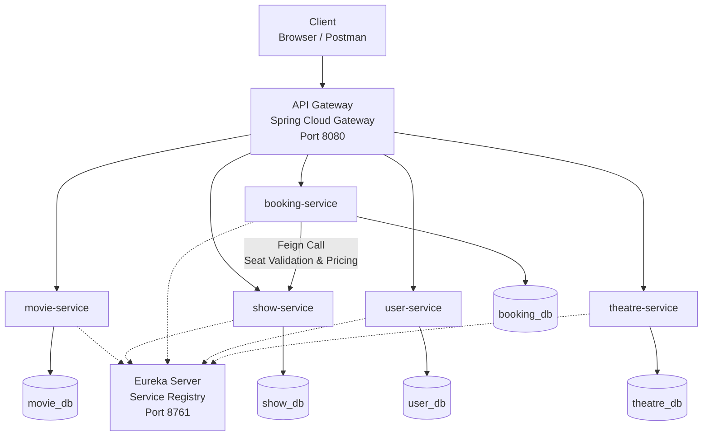

# 🎬 CineVault – Distributed Dynamic Movie Ticket Booking System

A production-style microservices architecture implementing distributed seat booking, dynamic pricing engine, service discovery, API gateway, and client-side load balancing using Spring Boot and Spring Cloud.

---

## 🏗 Architecture Overview

CineVault is a multi-module Maven microservices project built using:

- Spring Boot
- Spring Cloud Eureka (Service Discovery)
- Spring Cloud Gateway (Routing Layer)
- OpenFeign (Inter-service Communication)
- Spring Cloud LoadBalancer (Round-Robin)
- MySQL (Database per Service)

Each microservice runs independently and owns its own database.

---
## 🏗 Architecture Diagram

---

## 📸 System Proof Screenshots

### 🔹 Eureka Dashboard (All Services Registered)

---

### 🔹 API Gateway Routing via Postman

---

---

## 🧩 Microservices

| Service | Responsibility | Database |
|----------|---------------|-----------|
| movie-service | Manage movies | movie_db |
| show-service | Manage shows & seats | show_db |
| booking-service | Booking logic & pricing engine | booking_db |
| user-service | Manage users | user_db |
| theatre-service | Manage theatres & screens | theatre_db |
| api-gateway | Centralized routing | — |
| eureka-server | Service registry | — |

---

## 🚀 Key Features

### 🔹 Business Features
- Seat-level booking
- Double booking prevention
- Dynamic pricing engine
- Weekend multiplier (+20%)
- Morning discount (-10%)
- VIP & Premium seat category pricing
- Revenue calculation logic

### 🔹 Engineering Features
- Database-per-service design
- Service discovery via Eureka
- API Gateway routing
- Feign-based inter-service communication
- Client-side load balancing
- Centralized exception handling

---

## 🔄 Booking Flow (Distributed)

1. Booking request received via API Gateway  
2. booking-service calls show-service via Feign  
3. Seat availability validated  
4. Dynamic pricing rules applied  
5. Seats marked as booked  
6. Booking persisted in booking database  

---

## 🆚 Monolith vs Microservices

| Monolith | Microservices |
|------------|----------------|
| Single codebase | Multiple independent services |
| Shared database | Database per service |
| Direct method calls | REST + Feign communication |
| No service discovery | Eureka-based discovery |
| No load balancing | Client-side load balancing |
| Hard to scale selectively | Individual service scaling |

---

## ⚙ How to Run

1. Start eureka-server  
2. Start all microservices  
3. Start api-gateway  
4. Access endpoints via:
   - http://localhost:8080/movie-service/movies
   - http://localhost:8080/booking-service/bookings

---

📌 This project is the distributed evolution of the original CineVault monolithic booking system.
