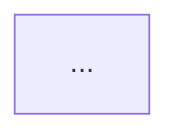

🎬 CineVault – Distributed Full Stack Movie Ticket Booking System

A production-style full stack microservices application implementing distributed movie ticket booking with dynamic pricing, service discovery, API gateway, and React frontend integration.

---

🚀 Overview

CineVault is a scalable system built using Spring Boot microservices + React frontend, demonstrating real-world distributed system design.

- Backend: Microservices architecture
- Frontend: React booking UI
- Communication: API Gateway + Feign
- Service Discovery: Eureka
- Database: MySQL (per service)

---

🧠 Tech Stack

Backend

- Java
- Spring Boot
- Spring Cloud (Eureka, Gateway)
- OpenFeign
- MySQL

Frontend

- React (Functional Components)
- JavaScript (ES6)
- HTML, CSS

---

🏗 Architecture Overview

CineVault is a multi-module microservices system:

- API Gateway for routing
- Eureka Server for service discovery
- Independent services with separate databases
- Feign for inter-service communication

---

## 🏗 Architecture Diagram

```mermaid
flowchart TD
...
```

    Client[Client Browser / Postman]

    Gateway[API Gateway Spring Cloud Gateway Port 8080]

    Eureka[Eureka Server Service Registry Port 8761]

    Movie[movie-service]
    Show[show-service]
    Booking[booking-service]
    User[user-service]
    Theatre[theatre-service]

    MovieDB[(movie_db)]
    ShowDB[(show_db)]
    BookingDB[(booking_db)]
    UserDB[(user_db)]
    TheatreDB[(theatre_db)]

    Client --> Gateway

    Gateway --> Movie
    Gateway --> Show
    Gateway --> Booking
    Gateway --> User
    Gateway --> Theatre

    Movie --> MovieDB
    Show --> ShowDB
    Booking --> BookingDB
    User --> UserDB
    Theatre --> TheatreDB

    Movie -.-> Eureka
    Show -.-> Eureka
    Booking -.-> Eureka
    User -.-> Eureka
    Theatre -.-> Eureka

    Booking -->|Feign Call Seat Validation & Pricing| Show

---

📌 Architecture Explanation

- All client requests go through API Gateway
- Services are dynamically discovered via Eureka
- Each service has its own database
- booking-service communicates with show-service using Feign
- Designed for scalability and loose coupling

---

🖥️ Frontend Integration (React)

A simple React UI demonstrates the complete booking flow.

Features

- Fetch movies
- View shows by movie
- Seat selection (Available / Booked)
- Booking with validation
- Integrated via API Gateway

🔄 Flow

Movies → Shows → Seats → Booking

---

📸 System Proof Screenshots

🔹 Eureka Dashboard (All Services Registered)

"Eureka Dashboard" (screenshots/eureka-dashboard.png)

---

🔹 API Gateway Routing via Postman

"Gateway Routing" (screenshots/gateway-routing.png)

---

## 📸 Frontend Screenshots

### 🎬 Movies Page

### 🎭 Shows Page

### 💺 Seat Selection

### ✅ Booking Success

### ⚠️ Validation Error

👉 These screenshots demonstrate complete end-to-end booking flow including success and validation handling.

---

🧩 Microservices

Service| Responsibility| Database
movie-service| Manage movies| movie_db
show-service| Manage shows & seats| show_db
booking-service| Booking logic & pricing| booking_db
user-service| Manage users| user_db
theatre-service| Manage theatres| theatre_db
api-gateway| Routing layer| —
eureka-server| Service registry| —

---

🚀 Key Features

🔹 Business Features

- Seat-level booking
- Double booking prevention
- Dynamic pricing engine
- Weekend pricing (+20%)
- Morning discount (-10%)
- VIP & Premium seat pricing

🔹 Engineering Features

- Microservices architecture
- Database-per-service pattern
- API Gateway routing
- Feign communication
- Load balancing
- Exception handling

---

🔄 Booking Flow (Distributed)

1. Request via API Gateway
2. booking-service calls show-service
3. Seat validation
4. Pricing applied
5. Seats booked
6. Data stored in DB

---

🆚 Monolith vs Microservices

Monolith| Microservices
Single codebase| Multiple services
Shared DB| Separate DB per service
Direct calls| REST + Feign
No discovery| Eureka
Hard scaling| Independent scaling

---

⚙️ How to Run

1. Start eureka-server
2. Start all microservices
3. Start api-gateway
4. Run frontend:

cd frontend
npm install
npm start

---

💡 Key Learnings

- Built distributed microservices system
- Implemented API Gateway & Eureka
- Designed real booking workflow
- Integrated React frontend with backend
- Applied real-world architecture patterns

---

📌 Future Enhancements

- JWT Authentication
- Payment integration
- React Router
- Docker deployment

---

🚀 This project demonstrates strong fullstack development, system design, and microservices architecture skills.